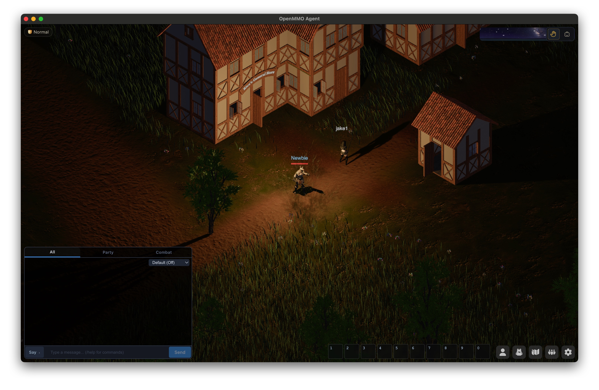
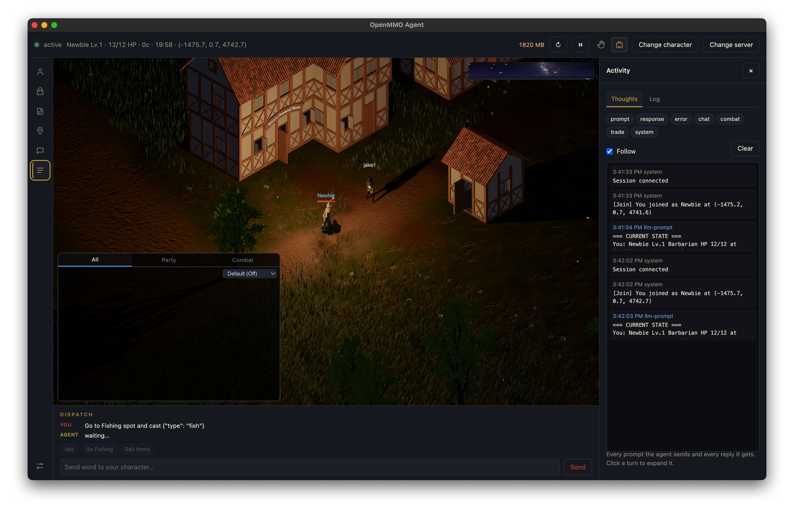

# OpenMMO Agent UI

A desktop client for playing [OpenMMO](https://openmmo.to.nexus) manually or
with an LLM at the controls. Pick a server, sign in with Google, choose a
character — it enters play immediately, Automatic if an LLM is configured,
Manual otherwise — then switch between the two live at any time.

**Manual Mode**



**Agent Mode**



It drives the official `agent-client` binary for Automatic play and adds what
that binary has no opinion about: connection profiles for more than one
server, encrypted key storage, Google device-flow sign-in as a button instead
of a log line, a live feed of every prompt and reply, and a read-only 3D
mirror of the agent's own session. Manual play skips `agent-client` entirely —
it embeds the real OpenMMO web client under your own Google sign-in.

The customized OpenMMO fork is pinned at `deps/OpenMMO`, so every desktop
commit identifies the exact web client, protocol, and native agent it builds.

## Setup

```bash
git clone --recurse-submodules git@github.com:OpenMMO-Agent-UI/openmmo-agent-ui.git
cd openmmo-agent-ui
npm install
npm run build:resources
npm start
```

The build deliberately skips Git LFS payloads; terrain assets stream from the
selected profile's terrain origin and are cached at runtime.

### Requirements

- Rust — a current stable, plus `wasm32-unknown-unknown` and `wasm-pack` for
  the client's wasm build
- Node 24+
- `git-lfs`. Skipping it is survivable: the local server notices the pointer
  files and fetches those assets from the official site instead.

### Protocol versions

The server checks the wire protocol **exactly** and refuses anything else, so
your checkout has to match what is deployed — which is not always upstream's
tip. `scripts/check-protocol.js` reads `shared/src/lib.rs` from an OpenMMO
checkout, so run it from inside `deps/OpenMMO` (or point it at one):

```bash
cd deps/OpenMMO && node ../scripts/check-protocol.js
# checkout speaks v11; asking wss://openmmo.to.nexus/ws ... accepted
```

or, from the repo root:

```bash
OPENMMO_CHECKOUT="$PWD/deps/OpenMMO" npm run check
```

It names the commit to move `deps/OpenMMO` to if the checkout doesn't match.
Only the handshake is sent, so nothing enters the world.

## How it works

The server permits exactly one controlling session per character, so the two
play modes get there differently:

**Manual play** is a direct connection: the embedded OpenMMO web client signs
in with your own Google session and talks straight to the configured server,
the same as playing in a browser. No relay, no `agent-client`.

**Automatic play** launches `agent-client`, which needs the one session for
itself — so watching it can't mean logging in next to it. Instead
`src/proxy.js` relays between `agent-client` and the game server on
loopback, byte for byte, and tees every message to a read-only spectator —
the desktop app's own 3D view of what the agent is doing. Nothing leaves the
machine; `agent-client/` itself stays at zero modifications.

Entering play tries Automatic first if an LLM backend is configured and
passes validation; otherwise, or if Automatic fails to start, it falls back
to Manual. A dropped Automatic session retries with backoff rather than
stopping. The mode buttons in the game header switch between the two on
demand.

## Screens

**Server** — pick a connection profile (server URL, terrain origin, Google
client id/secret bundled together, since a server's sign-in token has to
match its own client-id allowlist). The built-in `openmmo.to.nexus` profile
is fixed; custom ones can be created, edited, duplicated, deleted, and
test-connected before use.

**Login** — Google device-flow sign-in for the selected profile. A cached
credential skips straight to Character.

**Character** — two tabs: *Choose your character* (up to 3, server-enforced;
pick one to enter play, or delete it) and *Create a new character* (name,
class, gender — hidden once the account is at the cap). There is no separate
Play step: picking or creating a character enters play immediately.

**Game** — the header shows connection status, vitals, spectator memory
use, a reload button for the 3D view, **Apply & restart** (appears once a
setting changed while the agent is running), the Manual/AI mode switch, and
buttons to change character or server. The left rail opens drawers over the
view:

| Drawer | What it shows |
|---|---|
| Equipment | What's worn, slot by slot — visible only through the relay's view of inventory frames; the agent's own panel API reports the bag but never the gear. |
| Bag | What's carried. |
| Personality | This character's own prompt, layered on the shared rules. Saving while the agent is running restarts it. |
| Thoughts | Every prompt sent and every reply, with timings. |
| Log | The agent process's own stdout/stderr. |

**Dispatch**, docked under the game view, is the one control that reaches a
running agent: type an instruction and it arrives as the character's next
turn, best-effort — nothing forces the model to obey it, so the UI shows the
agent's next action right next to what you sent.

**Settings** (opened from the rail or the mode switch) has three tabs: LLM
(backend, model, API key), Automatic play (response-cadence sliders, whether
to keep adventuring while alone), and Advanced (raw intervals, watch port,
log level, concurrency, request timeout).

API keys and connection-profile secrets are encrypted with the OS keychain
(Electron `safeStorage`, with an AES-GCM fallback) and handed to the agent as
environment variables — never written into `config.toml`, so a config pasted
into a bug report carries no credential. `agent-client/data/config.toml` is
regenerated from the panel on every start; an existing hand-written file is
imported once and backed up next to it.

## Known limits

- Changing settings while the agent runs needs **Apply & restart**; the agent
  reads its config once at startup.
- Automatic play's spectator view starts from a snapshot, so anything the
  agent knows about but isn't currently tracking appears as it comes back
  into view.
- Launching from a terminal that is itself an Electron app (VS Code) can leak
  `ELECTRON_RUN_AS_NODE=1` and start the shell as plain Node. Use
  `env -u ELECTRON_RUN_AS_NODE npm start` if `app.whenReady` never resolves.

Maintaining this project — choosing the default model, pinning the OpenMMO
dependency, packaging and cutting a release — is covered separately in
[RELEASE.md](RELEASE.md).

## Layout

```
src/main.js                   Electron main process: IPC, sign-in and play-session orchestration, feed/vitals polling
src/agent.js                  resolves and spawns the agent-client binary, streams its logs, detects protocol mismatches
src/settingsStore.js          settings persistence, secrets, validation, credential-cache path
src/configToml.js             settings -> agent-client's data/config.toml
src/personalityText.js        per-character instance-prompt/memory paths, the sellable/dropable labels block
src/runtimeEnv.js             dev-checkout vs packaged-build paths, protocol-version resolution, data seeding
src/characterStore.js         per-character JSON stores: labels, coordinates, dispatch presets
src/characterSession.js       pre-flight sign-in and character CRUD, bypassing agent-client
src/connectionProfiles.js     saved server/terrain/Google-client profiles, encrypted secrets and credentials
src/googleAuth.js             client-owned Google device-flow sign-in, shared cache with agent-client
src/llmValidation.js          checks an LLM backend/model/key before Automatic play starts
src/playSession.js            Automatic/Manual state machine: picks a mode, retries drops, switches live
src/proxy.js                  agent <-> game server relay, and the spectator mirror
src/msgpack.js                the wire codec, in the dialect rmp_serde speaks
src/server.js                 serves client/dist, proxies /api and any missing/LFS-pointer asset
src/toml.js                   just enough TOML to import an existing config
src/workflow.js               sign-in/roster state machine (Server/Login/Character/Game screens)
src/preload.js                contextBridge surface exposed to the renderer
src/renderer/                 the panel: plain HTML/CSS/JS, native ES modules, no build step
  app.js                      state owner + coordinator: settings, play status, feed, vitals
  signInFlow.js               sign-in, connection profiles, character roster
  settingsPanel.js            cadence/toast/audio Settings tabs
  dispatchBook.js             coordinates + dispatch presets + directive tracking
  bagWorn.js                  worn/bag drawers, sellable/dropable labels
  actionToasts.js             the action-toast feed above the game view
  dom.js                      shared DOM helpers
deps/OpenMMO/                 pinned, customized OpenMMO dependency
overlay/                      desktop-owned prompts and agent data only
scripts/                      protocol checks, benchmarking, build/release helpers
RELEASE.md                    maintainer-facing: model choice, dependency pin, release process
test/                         node:test suites, run via `npm test`
```

## Anonymous usage statistics

The app counts app starts and which play modes get used, via
[Aptabase](https://aptabase.com) (open source, privacy-first). Each event
carries the event name, app version, and OS name — never your account,
characters, prompts, API keys, or server URLs, and no persistent device id.
Turn it off any time under **Settings → Display → Privacy**; off means
nothing is sent.

## License

MIT. OpenMMO itself is a separate project under its own license.
